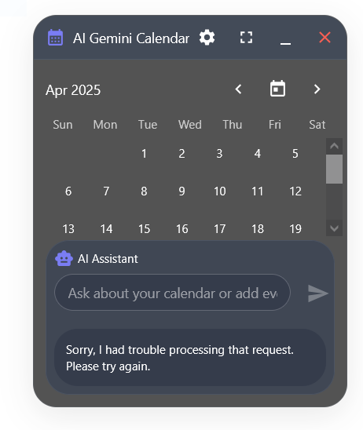

# ✨ AI Gemini Calendar

A beautiful, transparent calendar widget for Windows with AI assistance powered by Google's Gemini.



## ✨ Features

- **Sleek Transparent Design** - Elegant, floating widget that blends with your desktop
- **AI Calendar Assistant** - Powered by Google's Gemini AI to manage your schedule
- **Natural Language Event Creation** - Just tell the AI what you want to schedule
- **Dark Mode** - Easy on the eyes with adjustable transparency
- **Compact Mode** - Collapse to a smaller widget when you need more screen space

## 🚀 Getting Started

1. Download the latest release from the Releases page
2. Copy the `.env.template` file to `.env` and add your Gemini API key
   ```
   # Get your API key from https://makersuite.google.com/app/apikey
   VITE_GEMINI_API_KEY=your_api_key_here
   ```
3. Run the installer and follow the on-screen instructions
4. The calendar will appear as a floating widget on your desktop
5. Press Alt+Space to quickly expand or collapse the widget

> **Note**: The application works in offline mode without an API key, but online mode with Gemini AI provides more advanced features.

## 💬 Using the AI Assistant

Simply type your request in the assistant box at the bottom of the widget:

- "Schedule a meeting with John tomorrow at 2pm"
- "Remind me to call mom on Friday"
- "What events do I have next week?"
- "Move my dentist appointment to Wednesday"

## ⚙️ Customization

Click the settings icon in the title bar to:
- Adjust transparency
- Toggle "Always on top" mode
- Hide from taskbar

## 🔑 API Key

The application uses Google's Gemini AI API. The current version includes a demo API key, but for regular use, you should replace it with your own key in the settings panel.

## 💻 Technical Details

Built with:
- Electron for the desktop application
- React with Material UI for the interface
- Zustand for state management
- Google Generative AI for the AI assistant

## 📝 License

MIT License - Feel free to modify and use as you wish!

---

Made with ❤️ for better calendar management
